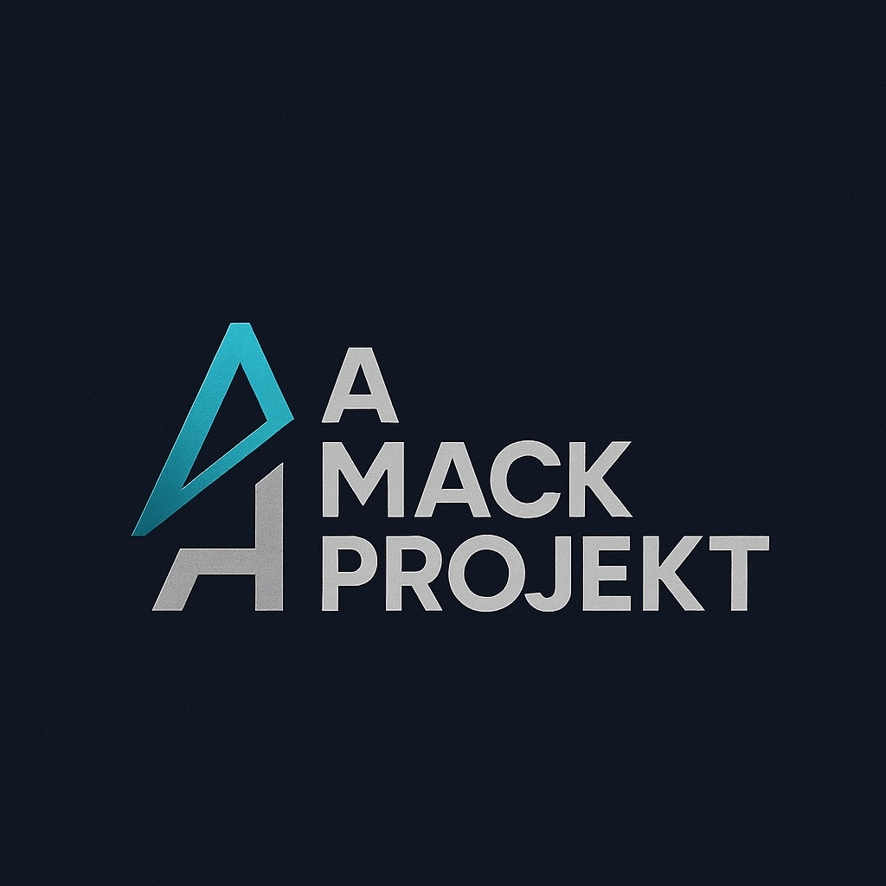
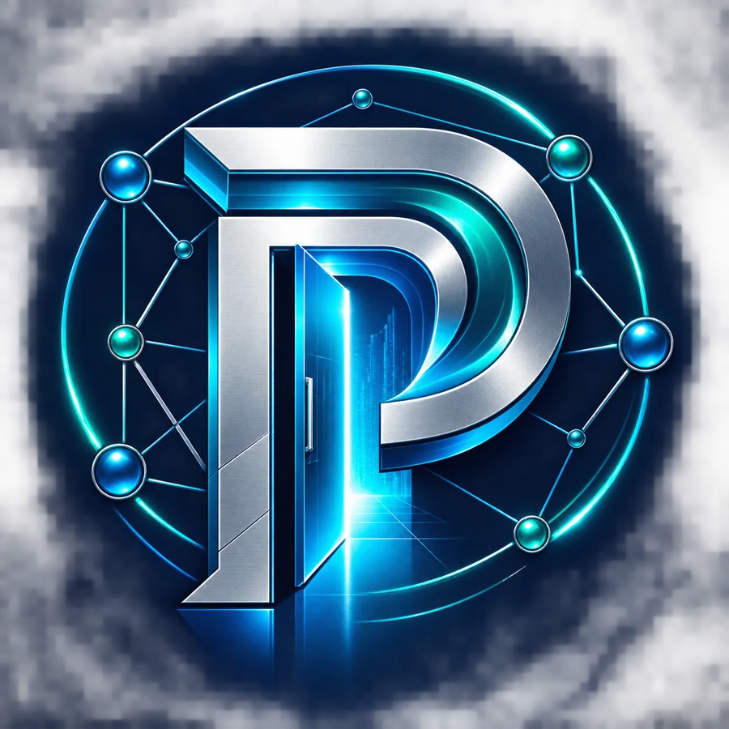

  

<h1 align="center">Technology. Culture. Purpose.</h1>

<strong>Independent ideas. Shared ambition.</strong> 
Building useful technology, expressive brands, and pathways forward.

  <a href="https://mackprojekt.com/">Explore the studio</a> &nbsp; · &nbsp;
  <a href="https://mackprojekt.com/innovation/">View the portfolio</a> &nbsp; · &nbsp;
  <a href="https://mackprojekt.com/partnerships/">Connect &amp; collaborate</a>

---

### The person behind the Projekts

I'm **Donyale “DThree” Mack**, founder of **A MackProjekt**. My work brings together technology, creative identity, and community. I build around the people a project serves—whether that means connecting a team, supporting a new beginning, or giving an idea its own voice.

### Selected work

<table>
<tr>
<td width="50%" valign="top">

<h3>A MackProjekt</h3>

<strong>The independent innovation studio.</strong>

A connected portfolio of technology, creative brands, books, and community ventures.

<a href="https://mackprojekt.com/">Explore AMP →</a>

</td>
<td width="50%" valign="top">

<h3>T.O.O.L.S. Inc.</h3>

<strong>Pathways to a new beginning.</strong>

Reentry support, workforce development, education, and mentorship to help people move forward.

<a href="https://www.sdtoolsinc.org/">Discover the mission →</a>

</td>
</tr>
<tr>
<td width="50%" valign="top">

<h3>Projekt Enterprise</h3>

<strong>People. Programs. Connected.</strong>

A connected platform for case management, team coordination, and organizational oversight.

<a href="https://mackprojekt.com/portals/">View the public overview →</a>

</td>
<td width="50%" valign="top">

<h3>I Want My Lawyer Present</h3>

<strong>Wear the message. Own the statement.</strong>

Apparel, merchandise, and brand storytelling built around bold expression and unmistakable identity.

<a href="https://mackprojekt.com/iwmlp/">Explore the brand →</a>

</td>
</tr>
</table>

AMP and T.O.O.L.S. show public homepage previews. Projekt Enterprise uses brand artwork; IWMLP shows a previously captured storefront preview.

### Beyond the platforms

**Identity. Dignity. Ownership.** Discover [KingMe](https://kingme.mackprojekt.com/) and [QueenMe](https://queenme.mackprojekt.com/), or explore [books and ideas](https://mackprojekt.com/books/) from the studio.

---

<strong>Have a purpose worth building around?</strong> 
<a href="https://mackprojekt.com/partnerships/">Let's connect.</a>

Created by Donyale “DThree” Mack · A MackProjekt

