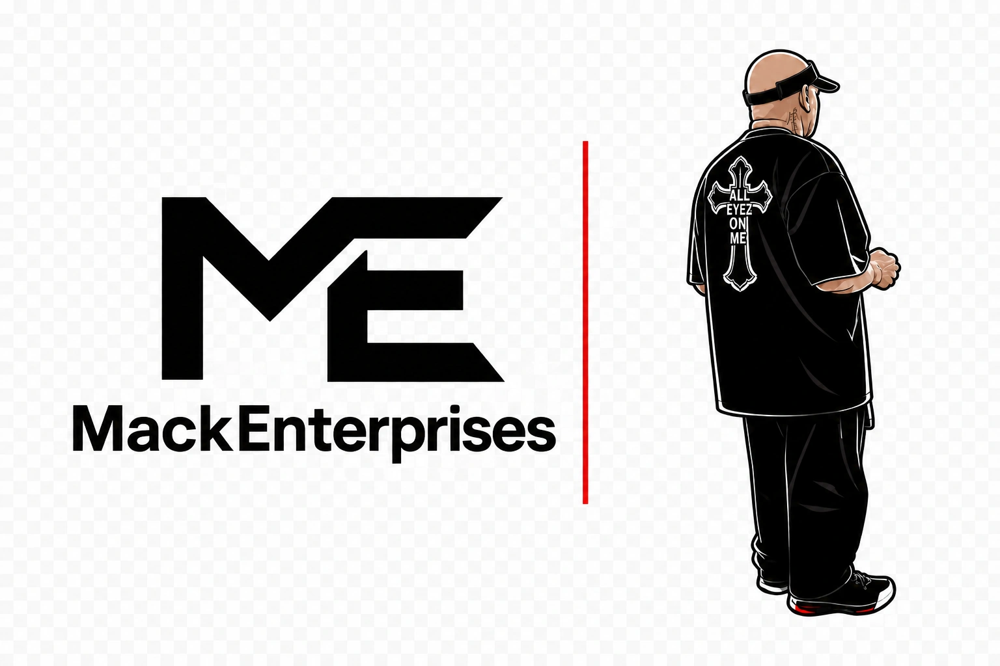
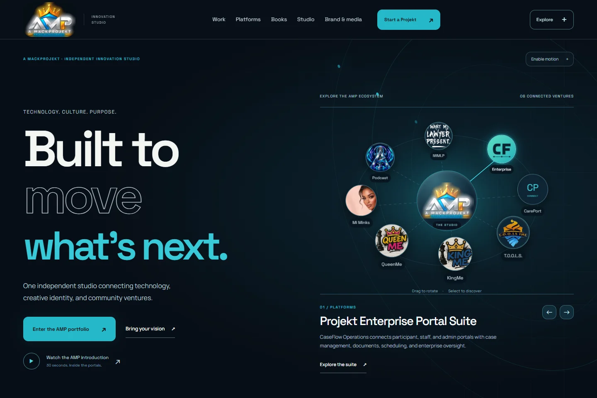
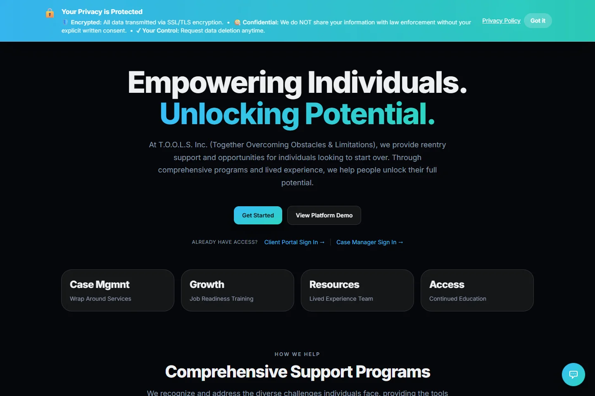
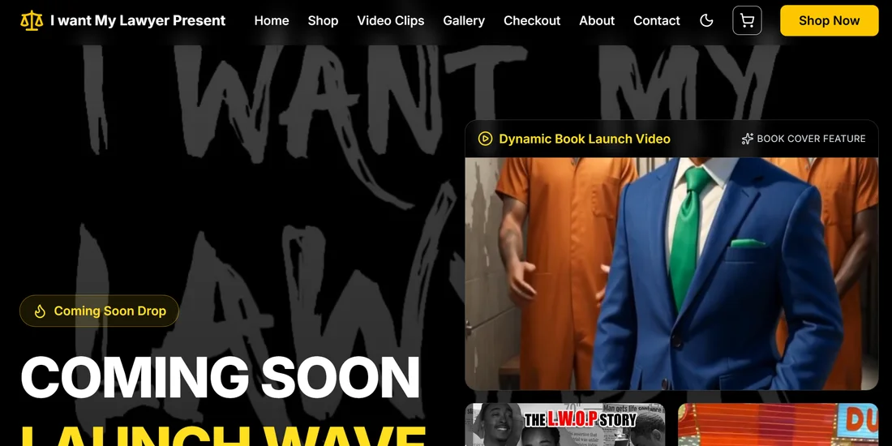

  

<strong>DONYALE “DTHREE” MACK &nbsp; / &nbsp; A MACKPROJEKT</strong>

<h1 align="center">Ideas with a voice. Technology with a purpose.</h1>

Builder. Author. Founder. 
Connecting useful technology, creative expression, and community.

  <a href="https://mackprojekt.com/"><strong>ENTER THE STUDIO ↗</strong></a> &nbsp; / &nbsp;
  <a href="https://mackprojekt.com/innovation/"><strong>EXPLORE THE WORK ↗</strong></a> &nbsp; / &nbsp;
  <a href="https://mackprojekt.com/partnerships/"><strong>LET’S CONNECT ↗</strong></a>

---

## Different expressions. One purpose.

I'm **Donyale “DThree” Mack**, the person behind **A MackProjekt**. I build around people—the work they need to do, the stories they carry, and the possibilities they see.

Some ideas become platforms. Some become books, brands, or a pathway to a new beginning. This is a look at that work.

## 01 / The studio
### A MackProjekt · Built to move what’s next.

Technology, creative identity, and community ventures—connected through one independent studio.

**[Step inside AMP →](https://mackprojekt.com/)**

---

## 02 / The mission
### T.O.O.L.S. Inc. · A new beginning deserves a pathway.

**Together Overcoming Obstacles and Limitations.** Reentry support, workforce development, education, and mentorship that help people take their next step.

**[Discover the mission →](https://www.sdtoolsinc.org/)**

---

## 03 / The platform
### Projekt Enterprise · Bring the work together.

> **People. Programs. Progress.**
>
> A connected place for case management, team coordination, and organizational oversight—built around the people delivering services and the participants moving toward their goals.

**[Explore the public overview →](https://mackprojekt.com/portals/)**

---

## 04 / The expression
### I Want My Lawyer Present · Wear the message.

Bold lettering. Apparel. A point of view. The digital storefront brings together merchandise, launch media, and the IWMLP brand story.

IWMLP brand and creative direction: Brian Mason. Image: previously captured storefront preview.

**[Explore IWMLP →](https://mackprojekt.com/iwmlp/)**

---

## Identity. Dignity. Ownership.

**[KingMe ↗](https://kingme.mackprojekt.com/)** &nbsp; · &nbsp; **[QueenMe ↗](https://queenme.mackprojekt.com/)** &nbsp; · &nbsp; **[Books & ideas ↗](https://mackprojekt.com/books/)**

Different ways to express a belief in growth, purpose, and what comes next.

---

<h2 align="center">Your next idea deserves a beginning.</h2>

<a href="https://mackprojekt.com/partnerships/"><strong>BRING YOUR VISION ↗</strong></a>

Donyale “DThree” Mack · A MackProjekt Technology. Culture. Purpose.

